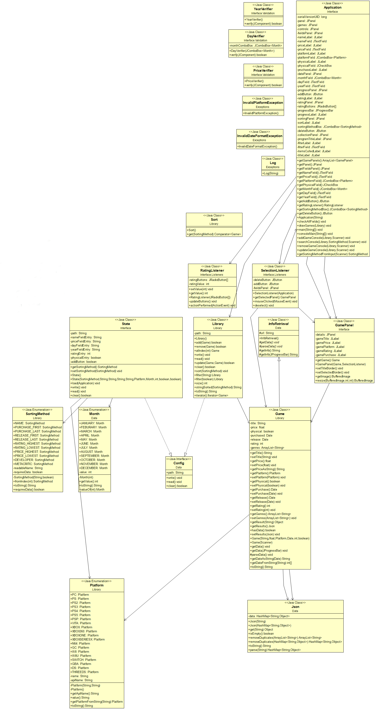

# *The Game Collector* Planning
### COMP503 Assignment 2

---

## Outline
This project will be a games collection catalouge. It will allow you to store, edit and remove games of various platforms, genres and purchase dates. It will display a list of titles inputted by the user, and sorted using various methods. The user can rate games in their collection, at that rating can be compared to other games. 

The software will use the Chicken Coop API to help with populating fields, as information such as release year, developers, and images, as it can pull this information from the MetaCritic database from a game's title.

The UI will be powered by Java's Swing framework, as it is the easiest way to communcate with a Java backend. As one of the requirements of the project is console I/O, there will be a Java console UI built in, but hidden unless enabled through console arguments.

As this project is a university assignment, and so all code must be written by me, there are some functions that would normally be taken from libraries, such as a JSON parser, that will have to be hand developed instead

## Project Structure (UML)

## Project Requirements

>#### Development Log
> A detailed log of the design, implementation and testing phases, detailing when work was done, how long it took,
> what was accomplished, and any problems encountered

>#### Java Source Code
> - Java console I/O 
> - File I/O
> - Relevant enumerated type utilisation

>#### Data Storage
> - Multiple collections 
> - Multiple collection algorithms

>#### Object Oriented Techniques
> - More than nine classes
> - Sensible relationships
> - Abstract and interface classes are utilised
> - Classes are encapsulated
> - Exceptions are used

>#### Runtime Execution
> - Meaningful, non-trivial problem is solved by the program
> - Program is interactive
> - Program is bug free

>#### Source Code Quality
> - Whitespace is consistent
> - All naming is sensible and meaningful
> - Comprehensively JavaDoc'd
